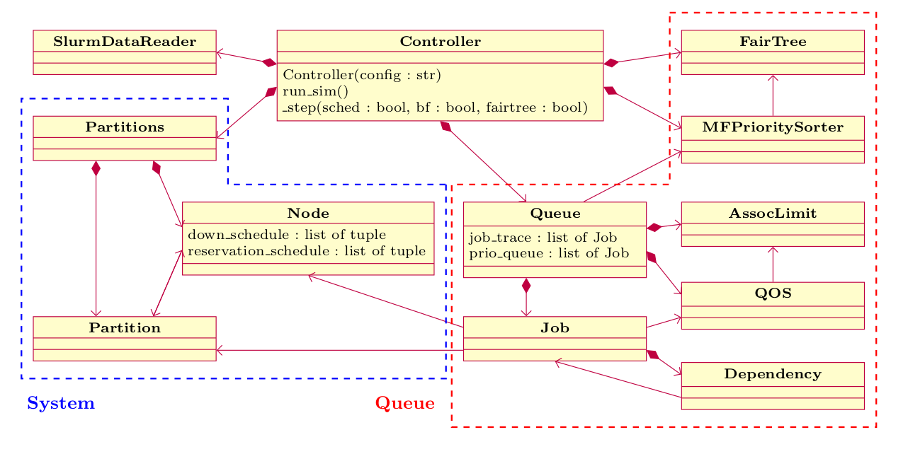

# FastSim

FastSim is a lightweight SLURM simulator tool, originally developed by Alexander Wilkinson as part of an internship program in the HPE HPC/AI EMEA Research Lab. This tool simulates SLURM scheduling using historical workload accounting data, providing a fast mechanism for evaluation and comparison of scheduling strategies incorporating external factors such as energy awareness. 


## Overview



The simulator is designed to include the features of Slurm most relevant to scheduling so that the
aggregate performance of a system over its historical job data can be simulated accurately. It was
developed by implementing features in order of assumed importance to scheduling until accurate
simulation of ARCHER2 was possible. The simulator is general enough to read in any system running
Slurm and at least run. Accurate simulation will might require examining the Slurm configuration
and implementing features that were not relevant for ARCHER2.

This project is proof of principle that something in between some generic FIFO+Backfilling
code and full Slurm simulation is valuable for HPC scheduling research. It is not a finished
product, and is undergoing further development.


## References

[Wilkinson, Alex & Jones, Jessica & Richardson, Harvey & Dykes, T. & Haus, Utz-Uwe. (2023). A Fast Simulator to Enable HPC Scheduling Strategy Comparisons. 10.1007/978-3-031-40843-4_24.](docs/slurm_sim_paper.pdf).

## Running the Simulation

I have been using a Python 3.8.5 virtual environment. There is a requirements.txt for pip or just
do:

```
pip install pandas numpy pyyaml dill matplotlib
```

The simulator uses dumps from Slurm accounting which can be made using the [`slurm_dump.sh`](scripts/slurm_dump.sh) script.
It can take quite a long time for a large number of jobs since it is anonymising all users and
accounts.

The simulation is configured with yaml files that point to the Slurm dumps, set some simulation
specific parameters, and explicitly override any desired Slurm parameters. An example is
[here](configs/4monthdata_baseline_conf.yaml).

The simulation is started by initialising `Controller` with a config file path and calling
`run_sim()`. This can be done with `main.py` like:

```
python main.py --dump_sim_to /path/to/save/results /path/to/config
```

## Limitations

Some notable things not implemented are:
- Allocation of resources other than nodes. Implementing would require giving each job a set of
  possible nodes based on requests and checking against these instead of partition + tracking
  cpu/memory/... of each node and checking this when scheduling.
- Partition level resource limits
- Topology aware node allocation
- Various Slurm flags/parameters for resource limits and reservations
- Job preemption
- Heterogeneous jobs

## Notes on the Code

### Backfilling

The backfilling is simulated in time steps of time elapsed between the thread yields locks. In this
time the number of jobs processed comes from `approx_bf_try_per_sec` which is estimated for the
system in question (can use `sdiag` command for this). It is assumed that the Slurm parameters
`defer` and `bf_continue` are set, I think this is true for systems with a high throughput.

The backfilling keeps track of the job with the shortest requested time still left in the queue and
the maximum requested time for a job to be backfilled on a node and run immediately. If the
shortest job cannot possibly be scheduled immediately, the backfilling is not computed any more to
save time. This saves time on ARCHER2 but it might not for different workloads.

### Down Nodes

Drain events are simulated as expected. Down events are shifted forward to the next point in time
when the node is idle. This is done because the effect of down nodes is already present in the
workload through jobs with shorter runtimes.

### Job Data Reading

This has become a bit of a mess as the raw job data needs a fair amount of processing. It would be
better do this once in a separate script and save to disk.

The Reason field can give insight into any missing data in the job record. For jobs with a Reason
that tells us there is something that cannot be simulated, the jobs are marked with an
'ignore_in_eval' flag so they can be identified in evaluation.

### HPE Restrict Long Jobs

There is a sliding reservation that is set every 5 minutes to the hour with a start time at the
next hour. This is for maintenance and slides using a script outside of Slurm. A significant
proportion of the data reader is just to explore different ways of interpreting which nodes are in
this reservation and when. All of this is specific to ARCHER2 but is ignored unless the
`hpe_restrictlong_sliding_reservations` parameter is specified.

### Queues

There are currently separate queue depending on reservation. These should be joined into a single
queue and sorted such that the jobs with advanced reservations are at the front.

MaxSubmitJobs and MaxSubmitNodes resource limits are enforced by holding submission of jobs until
earliest possible time they will not breach these limits. Jobs are resubmitted in the order of
original submission.

### List Sorting

Queues are sorted in reverse order so that the next item can be popped from the end and memory does
not need to be shifted around.

To ensure that the simulation is deterministic, unique object ids are used to sort lists when there
are ties. This is important for comparing simulations and maintaining sanity when refactoring.

Swapping lists for heaps would be a good performance optimisation since often only need the know
the highest priority object at each step.

## Contributing

We require all commits to be signed off in compliance with the [Developer Certificate of Origin (DCO)](./DCO).

To sign off a commit, add a line like this at the end of your commit message:

````
Signed-off-by: Your Name your.email@example.com
````

Git can do this automatically with the `-s` flag, if `user.name` and `user.email` are configured:

````
git commit -s -m "Your commit message"
````

Pull requests with unsigned commits will not be merged.

## Contributors

The following people have contributed to this project, either via direct code contributions, or via design and/or supervisory input. 

- Alexander Wilkinson
- Tim Dykes 
- Jess Jones
- Harvey Richardson
- Utz-Uwe Haus
