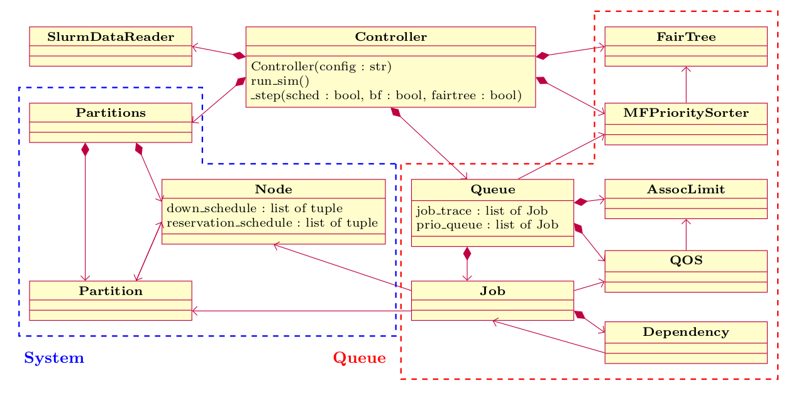

# FastSim

FastSim is a lightweight SLURM scheduling simulator that replays a historical workload trace (from sacct / sacctmgr) against a simplified model of SLURM’s scheduling behavior. It was originally developed by Alexander Wilkinson in the HPE HPC/AI EMEA Research Lab to enable fast, repeatable comparisons of scheduling strategies, including experiments with energy-aware / power-aware prioritization.

FastSim is intentionally not a full SLURM emulator. It targets the subset of SLURM behavior that most strongly affects job start times and aggregate throughput, while remaining quick to iterate on for scheduling research.

---

## Overview

At a high level FastSim:

1. Loads SLURM accounting and configuration dumps (jobs, QOS, associations, reservations, node events, slurm.conf).
2. Builds a simulation state (nodes, partitions, fairshare tree, job queues).
3. Advances time event-to-event (job submit/end, reservation changes, node events).
4. Runs a simplified SLURM-like scheduling loop:
   - reservation scheduling
   - main scheduling
   - backfilling (approximate, time-sliced)

---

## References / Citation

If you use FastSim in academic work, please cite:

- Wilkinson, Alex & Jones, Jessica & Richardson, Harvey & Dykes, T. & Haus, Utz-Uwe. (2023).
  A Fast Simulator to Enable HPC Scheduling Strategy Comparisons.
  DOI: 10.1007/978-3-031-40843-4_24

---

## Key Features

FastSim models (approximately):

- Multi-factor priority ordering (age / fairshare / job size / partition / QOS)
- Fairshare via an association tree with decay
- QOS & association limits (e.g., MaxJobs / MaxSubmit… in a simplified form)
- Advanced reservations (from both current and historical reservation dumps)
- Backfilling (time-sliced approximation intended to match “throughput” behavior)
- Node state events (drain/down/up handling with pragmatic approximations)
- Optional power-aware priority (requires predicted power + runtime inputs)

---

## Limitations (Notable)

Some notable behaviors are not implemented (or only partially approximated):

- Non-node resources (CPU/memory/GRES), and fine-grained TRES accounting
- Partition-level resource limits beyond basic filtering
- Full topology-aware placement
- Job preemption
- Heterogeneous jobs
- Many SLURM flags/edge-case reservation behaviors

FastSim aims to be “right enough” for aggregate scheduling research on a given system/workload once calibrated, not a drop-in replacement for SLURM.

---

## Repository Layout

- scheduler/
  - `main.py` — CLI entry point (offline mode + strict-lockstep server mode)
  - `controller.py` — core simulation loop and scheduling/backfilling
  - `config.py` — YAML + slurm.conf config loader and defaults
  - `data_reader.py` — loads and cleans SLURM dumps
  - `partition.py` — node + partition models; free-block tracking
  - `job_queue.py` — job objects, queues, holds/limits, dependencies
  - `fairshare.py` — fairshare tree + decay
  - `priority_sorters.py` — priority calculation and job ordering
  - `post_process.py` — post-processing utilities (e.g., down-node job splitting)
  - `plotting.py` — plotting helpers (optional)
  - `interactive_shell.py` — Ctrl-C pause shell (inspect simulation state)
  - `aux_funcs.py` — parsing utilities (nodelists, submit lines, etc.)
- `configs/` — example YAML configs
- `scripts/` — scripts to dump SLURM data (`slurm_dump.sh`, `slurm_dump_anon.sh`)
- `docs/` — paper PDF + diagram
- `LICENSE`, `DCO`

---

## Installation

FastSim is Python-based. It has been used primarily with Python 3.8+, and should work on newer 3.x versions as well.

### 1) Create and activate a virtual environment (recommended)

    python -m venv .venv
    source .venv/bin/activate

### 2) Install dependencies

    pip install -r requirements.txt

---

## Input Data

FastSim can run from two levels of input:

1. **Job trace + slurm.conf only (minimal mode)** — no privileged SLURM access
   required. Suitable when job history comes from a database rather than a live
   cluster.
2. **Full SLURM dumps** — collected from a live cluster with the provided
   scripts; enables real associations, QOS limits, node events, and
   reservations.

Any optional dump can be added independently on top of minimal mode; each is
used when provided and synthesized (or treated as empty) when not:

| Missing input | Behavior |
|---|---|
| `assocs_dump` | Fairshare tree synthesized from the trace: every account and user gets **identical shares** (allocation awards are generally not visible without privileged access). No association limits. |
| `qos_dump` | QOS synthesized for all names referenced by the trace and slurm.conf, with equal priority and no limits. |
| `node_events_dump` | No node down/drain events simulated. |
| `resv_dump_current` / `resv_dump_historic` | Each independently optional. Absent reservations are ignored; jobs that requested them run as normal jobs (marked `ignore_in_eval`). |

A minimal example is `configs/trace_only_conf.yaml`.

### Job trace format (minimal mode)

A pipe-delimited CSV. Required columns:

    JobID|Submit|Start|End|State|Partition|User|Account|ReqNodes|AllocNodes|Timelimit

Optional columns used when present: `QOS` (default `normal`),
`ConsumedEnergyRaw` (default: zero-power fallback), `JobName`, `Reason`,
`SubmitLine` (dependencies/reservations/etc. are parsed from it).

## Collecting Input Data (SLURM Dumps)

FastSim expects a directory of SLURM accounting/configuration dumps. Two scripts are provided:

- `scripts/slurm_dump.sh` — straightforward dump
- `scripts/slurm_dump_anon.sh` — anonymizes users/accounts (can be slow on large systems)

### Output files expected

The simulator expects paths to these files (see config section):

- `sacct_jobs.csv`
- `sacctmgr_assocs.csv`
- `sacctmgr_qos.csv`
- `sacctmgr_events.csv`
- `sinfo_resv.csv`
- `sreport_resv.csv`
- `slurm.conf`

Note: the scripts use SLURM’s `-p` “pipe output” formats and some sed/awk cleanup. If you generate these files differently, keep the same delimiter style and columns.

### Example usage

Edit STARTTIME and ENDTIME inside the script, then run on a login node with appropriate permissions:

    bash scripts/slurm_dump.sh
    # or
    bash scripts/slurm_dump_anon.sh

This creates a `slurm_dump/` directory and (in the non-anon script) archives it.

---

## Configuration (YAML)

FastSim is configured via a YAML file (see `configs/`). The YAML file:

1. Points to the dump filepaths.
2. Specifies simulation start/end times.
3. Optionally overrides scheduler parameters and simulator knobs.

FastSim also reads slurm.conf and uses it as a source of defaults for known parameters. YAML can override those values.

### Required YAML fields

These keys must be present:

- `job_dump`
- `slurm_conf`
- `considered_partitions`
- `sim_start`, `sim_end`

Optional input dumps (see Input Data above): `assocs_dump`, `qos_dump`,
`node_events_dump`, `resv_dump_current`, `resv_dump_historic`.

Examples: `configs/trace_only_conf.yaml` (minimal), `configs/default_conf.yaml`
(full dumps).

### Common simulation keys

Most commonly edited keys include:

- `system` — system identifier for node parsing conventions (e.g. default, kestrel)
- `considered_partitions` — list of partitions to simulate (jobs in other partitions are ignored)
- `initialize` — whether to build an initial running state at sim_start
- `sim_start`, `sim_end` — ISO8601 timestamps, e.g. 2025-01-01T00:00:00
- `save_interval_steps` — checkpoint interval in steps

### Scheduler / backfill knobs

Examples (all are documented inline in `configs/default_conf.yaml`):

- `default_queue_depth`
- `sched_interval`
- `sched_min_interval`
- `bf_resolution`
- `bf_max_job_test`
- `bf_window`
- `bf_interval`
- `bf_max_time`
- `bf_yield_interval`
- `bf_yield_sleep`
- `max_switch_wait`
- `max_switch_nodes`
- `approx_bf_try_per_sec` — throughput calibration for backfill’s time-sliced approximation
- `approx_excess_assocs` — trims unused associations for fairshare scaling

### Reservations and system behavior

- `impromptu_reservation_names` — reservation names treated as reactive holds (do not cause advance draining)
- `nodes_down_in_blades` — system-specific behavior for grouping node-down events
- `hpe_restrictlong_sliding_reservations` — ARCHER2/HPE-specific behavior; ignored unless set

### Power-aware scheduling (optional)

To enable power-aware prioritization you typically add:

- `predicted_power` — path to a pickle mapping job IDs → predicted power (or equivalent structure used by the reader)
- `predicted_runtime` — path to a pickle mapping job IDs → predicted runtime
- `Pdefault` — default power-per-node fallback

FastSim’s priority sorter is constructed with:

- `power_weight` (defaults to 0 if not present)
- `power_alpha`, `power_beta`, `power_gamma`
- `power_time_boost_start`, `power_time_boost_end`

See `configs/kestrel_conf.yaml` for an example.

---

## Running FastSim (Offline Mode)

The main CLI entry point is:

    python scheduler/main.py <config.yaml> --output <results.pkl>

Example:

    python scheduler/main.py configs/default_conf.yaml --output results.pkl

Optional:

- `--max_steps N` — stop after N simulation steps (0 means run until complete)

Tip: Always provide `--output`. In offline mode FastSim saves the final job history to that pickle path.

---

## Pausing / Interactive inspection

FastSim includes an interactive “pause-time” object browser that lets you inspect the live simulator state while it’s running.

### How to pause and resume
- Press `Ctrl-C` once during a run to pause and drop into the inspector.
- Type `resume` (or `exit`, `quit`, `q`) to leave the inspector and continue the simulation.
- Press `Ctrl-C` again (or interrupt the process normally) if you want to abort the run entirely.

You’re browsing live Python objects from the simulator, so what you see reflects the exact state at the paused timestep.

---

### What you can inspect (top-level roots)

When the shell starts, it exposes a small set of “roots” at `/`:

- `ctl` — the controller instance (overall simulation state)
- `queue` — `ctl.queue` (queued jobs, holds, reservation queues, etc.)
- `parts` — `ctl.partitions` (nodes, partitions, free-blocks, reservation mapping)

From there, you can navigate into dictionaries, lists/tuples/sets, and object attributes uniformly.

How traversal works:
- For `dict`: children are keys
- For `list`/`tuple`/`set`: children are indices (`"0"`, `"1"`, …)
- For objects: children are non-private attributes (skips `_private` and callables/methods)

---

### Command reference

Navigation and display:
- `ls`  
  List children of the current object, with an index, name, and a short type/size description.
- `cd NAME` or `cd #`  
  Descend into a child by name or by the numeric index shown in `ls`.
- `cd ..` / `up`  
  Go up one level.
- `cd /`  
  Return to root.
- `pwd`  
  Print the current path.
- `cat` / `cat NAME` / `cat #`  
  Pretty-print the current object, or a selected child.

Simulation helpers (domain-specific):
- `stats`  
  One-line status: `Time=... Running=... Queued=...`
- `wait_history [-n COUNT] [partition]`  
  Show recent wait-reason entries for the first `COUNT` queued jobs (optionally filter by partition name). This is useful for answering “why isn’t this job starting?”
- `last_skip [partition]`  
  Print the most recent skip reason for each queued job (optionally filtered to a partition).
- `step [N]`  
  Execute `N` internal controller `_step()` iterations while staying in the inspector, then return.  
  This is only available if the controller exposes a thread-safe `_step_lock` (see below).

Exit:
- `resume` / `exit` / `quit` / `q`  
  Leave the shell and resume the simulation.

Convenience:
- `cd` has tab-completion for child names.

---

### Practical inspection “recipes”

These examples assume you’re at the root (`/`).

1) Check overall progress and queue depth
- Run: `stats`
- Then: `cd queue` → `ls` to find where the main pending queue lives (commonly `queue.queue`)

2) Inspect the first few queued jobs
- `cd queue`
- `cd queue` (the attribute that holds the list of pending jobs)
- `ls`
- `cd 0` (or any index)
- `cat` to view the job object (or `cat jid`, `cat req_nodes`, etc. depending on fields)

3) Why aren’t jobs starting?
- `wait_history -n 20`  
  Shows the last few “wait reason” entries per job (typically updated when a job is evaluated and skipped).
- `last_skip`  
  Quick glance: last skip reason per job.

4) Look at node / partition availability
- `cd parts`
- Use `ls` to find structures like partitions/nodes/free-blocks (often something like `parts.partitions`, `parts.nodes`, `parts.free_blocks`)
- `cat free_blocks` can be huge; prefer drilling down:
  - `cd free_blocks` → `ls` → `cd <reservation_name>` → `ls` → `cd <interval>` → `ls`

5) Inspect currently running jobs
- `cd ctl`
- Look for a container like `running_jobs` (often a `dict` keyed by job ID):
  - `cd running_jobs` → `ls` → `cd <jobid>` → `cat`

---

### Notes and safety

- The inspector is designed for read-only exploration, but you are interacting with live objects. Avoid mutating data structures from the shell unless you know exactly what you’re doing (FastSim doesn’t guard state against manual edits).
- `cat` can print very large objects. Prefer `ls` → `cd` into something smaller before printing.
- Sets are shown as indexed children in `ls`, but their order is not guaranteed.

---

### About `step` (manual stepping inside the inspector)

The `step` command calls `Controller._step(...)` repeatedly while you stay paused. This is mainly useful in threaded modes (like the ZMQ server mode), where you want to advance the simulation a small number of ticks and immediately re-inspect state.

Requirements:
- The controller must expose a thread-safe lock named `_step_lock` (a `threading.Lock`), and the normal run loop should honor it.

If `_step_lock` is missing, the inspector will print:
- `Controller has no _step_lock; step unavailable.`

If you don’t need manual stepping, you can ignore this feature entirely — the rest of the inspector works without it.

---

## Running FastSim (Strict Lockstep Server Mode)

FastSim can act as a slice server for Digital Twin integration. In this mode it:

- runs the simulator in a background thread
- publishes per-second slices of running job IDs
- enforces strict lockstep backpressure: the simulator will stall if the client does not ACK progress

Run:

    python scheduler/main.py <config.yaml> --serve --endpoint ipc:///tmp/fastsim.sock --buffer_seconds 900

- `--endpoint` can be `ipc:///...` or `tcp://0.0.0.0:5555`
- `--buffer_seconds` controls how far ahead the simulator can run without client ACKs

### ZMQ protocol (REQ/REP)

Requests are JSON objects:

- `{"op":"INIT"}` → `{"init_time":"<ISO8601>"}`
- `{"op":"HEALTH"}` → `{"latest_t": int, "last_acked_t": int, "closed": bool}`
- `{"op":"GET", "t": <int>}` → `{"t": <int>, "running_ids": ["<jobid_str>", ...]}`
  After replying, the server ACKs t internally (strict lockstep).
- `{"op":"END"}` → `{"ok": true}`

---

## Output Format

In offline mode, FastSim writes a pickle (Pandas DataFrame) containing the simulated job history (completed jobs). The columns are derived from the internal Job object and typically include fields like:

- `jid`, `user`, `account`, `name`
- `submit`, `start`, `end`, `runtime`, `reqtime`
- `nodes`, `assigned_nodes`
- `partition`, `qos`, `partition_qos`
- `reason`, `state`, `cancel`, `cancelled_t`
- `wait_history` (timestamps + reasons)
- `node_timeline` (for jobs affected by down-node behavior)
- `predicted_power`, `predicted_runtime`, `true_node_power`, etc. (if present)
- `ignore_in_eval` (for jobs marked as not suitable for evaluation)

Note: association objects are not serialized to the output table.

---

## Post-processing & Plotting (Optional)

Some simulations (especially those modeling node-down behavior) can produce shrunk jobs or split execution timelines. Post-processing utilities exist in:

- `scheduler/post_process.py`

Plotting helpers are in:

- `scheduler/plotting.py`

---

## Notes on Model Fidelity

### Backfilling

Backfilling is simulated in time steps tied to scheduler yield/lock intervals rather than per-job exact SLURM internals. The parameter approx_bf_try_per_sec is used to approximate how many backfill attempts could be made per second on the target system.

FastSim includes optimizations (e.g., early termination when the shortest request-time job cannot possibly fit immediately) that can significantly reduce runtime on large traces.

### Down nodes

Drain events are simulated in a conventional way. Down events are handled pragmatically. If the node is idle when it goes down, it is placed in the down state as expected. When a node goes down while running a job, the simulator searches for a replacement node for that job. If no replacement node can be found, the job is shrunk by one node and a new, single-node job is added to the front of the queue with a runtime equal to the remaining runtime for that job. This maintains adherence to the actual historical node down events while minimizing impacts to the queue.

### Determinism

Where tie-breaking is needed, FastSim uses unique IDs to keep ordering deterministic across runs, which is helpful for regression testing and refactoring.

---

## Troubleshooting

- Simulation produces no/odd results
  Common causes:
  - `considered_partitions` excludes most jobs
  - `sim_start` / `sim_end` window does not overlap with job timestamps
  - dump scripts didn’t match expected columns/delimiters
  - system-specific node naming conventions aren’t handled (see system: in config)

---

## Contributing

We require all commits to be signed off in compliance with the Developer Certificate of Origin (DCO) in ./DCO.

To sign off a commit, add a line like this at the end of your commit message:

    Signed-off-by: Your Name your.email@example.com

Git can do this automatically with the -s flag:

    git commit -s -m "Your commit message"

Pull requests with unsigned commits will not be merged.

---

## Contributors

The following people have contributed to this project, either via direct code contributions, or via design and/or supervisory input:

- Alexander Wilkinson
- Tim Dykes
- Jess Jones
- Harvey Richardson
- Utz-Uwe Haus
- Dmitry Duplyakin
- Kevin Menear

---

## License

MIT License — see LICENSE.
